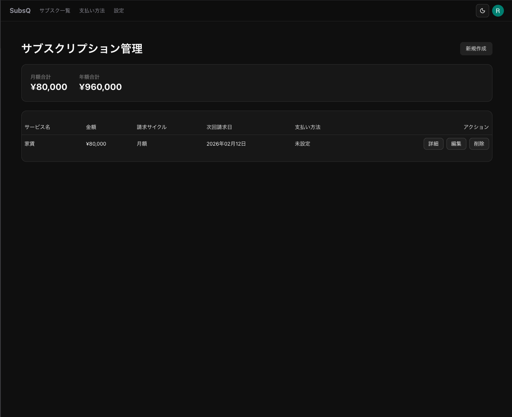
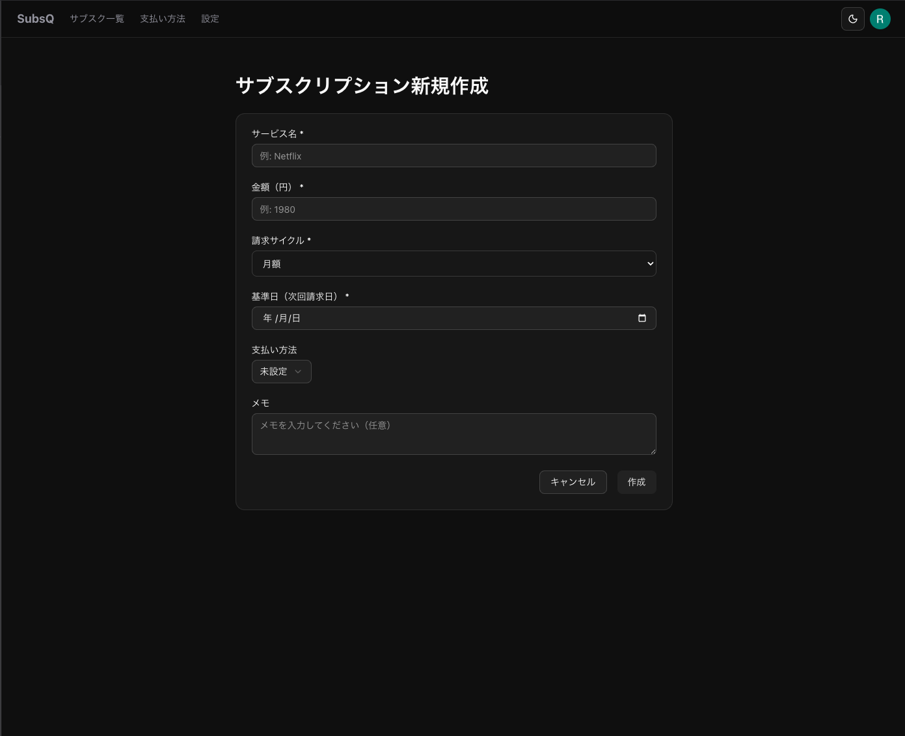
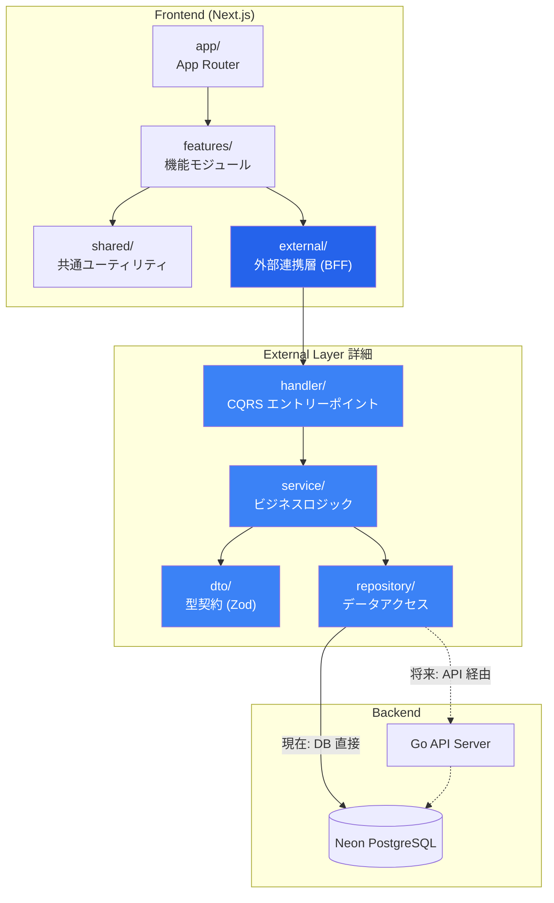
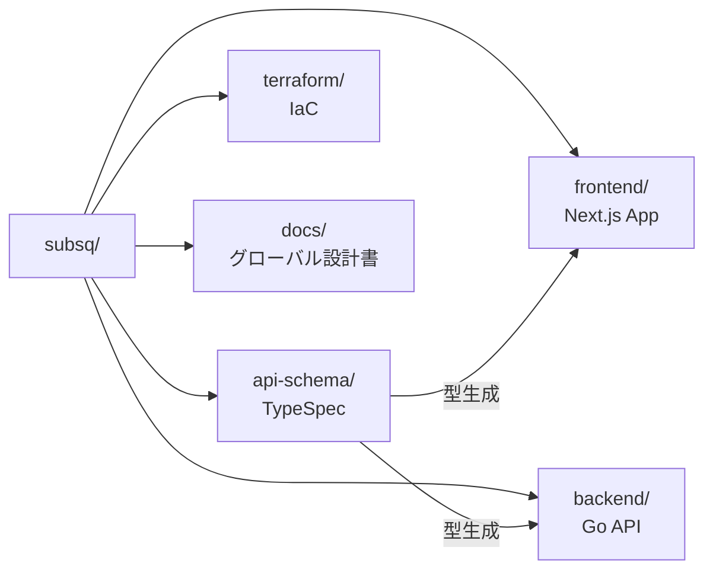
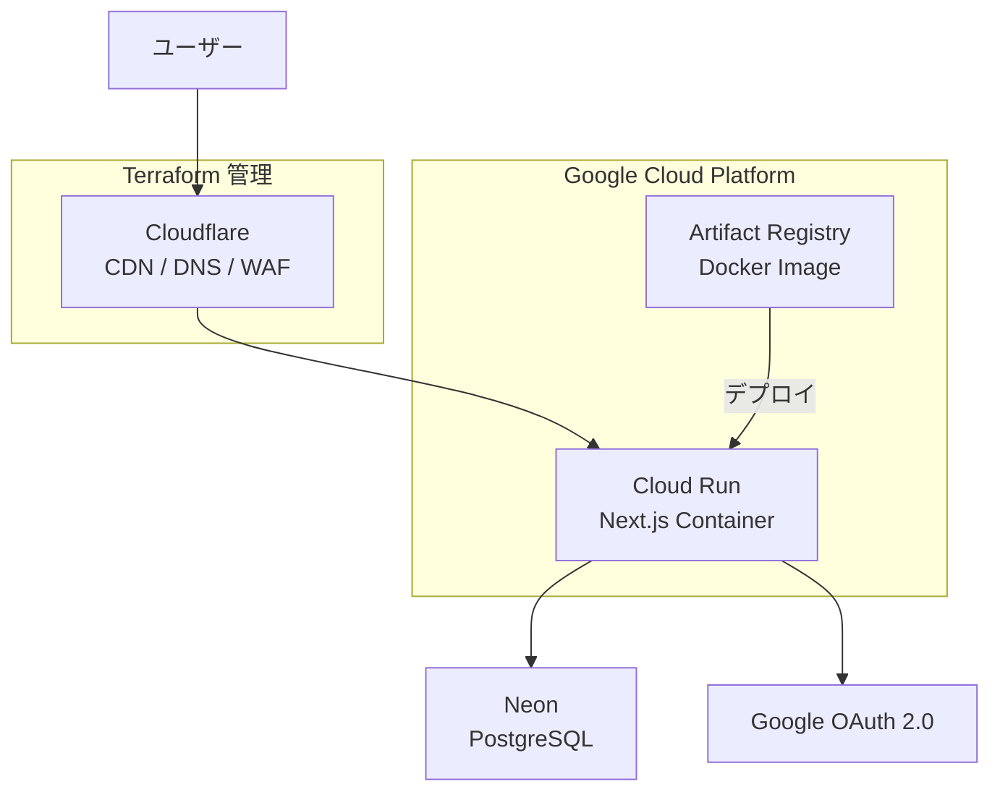

# SubsQ

サブスクリプション管理に特化した Web アプリケーション


## スクリーンショット

| ダッシュボード | サブスクリプション登録 |
|:---:|:---:|
|  |  |

## 概要

SubsQ は、サブスクリプションの手動登録・カード型表示・コスト可視化を提供する Web アプリケーションです。

🔗 **サービス URL**: [https://subsq-app.com](https://subsq-app.com)

## 技術スタック

### Frontend

| 技術 | 用途 |
|------|------|
| Next.js 16 (App Router) | フレームワーク |
| TypeScript 5.9 | 言語 |
| TanStack Query | サーバー状態管理 |
| React Hook Form + Zod | フォーム処理・バリデーション |
| Tailwind CSS + shadcn/ui | スタイリング・UI コンポーネント |
| Better Auth | 認証（Google OAuth / Stateless セッション） |
| Drizzle ORM | 型安全な DB アクセス |

### Backend

| 技術 | 用途 |
|------|------|
| Go | API サーバー（移行中） |
| TypeSpec | API スキーマ定義 |
| OpenAPI | クライアント自動生成 |

### Infrastructure

| サービス | 用途 |
|----------|------|
| Google Cloud Run | コンテナホスティング |
| Google Artifact Registry | Docker イメージ管理 |
| Neon PostgreSQL | サーバーレスデータベース |
| Cloudflare | CDN・DNS・DDoS 対策 |
| Terraform | Infrastructure as Code |

### DevOps

| ツール | 用途 |
|--------|------|
| GitHub Actions | CI/CD パイプライン |
| release-please | セマンティックバージョニング・CHANGELOG 自動生成 |
| Renovate | 依存関係の自動更新 |
| Biome | リンター・フォーマッター |
| Playwright | E2E テスト |
| commitlint + lefthook | Conventional Commits の強制 |

## アーキテクチャ概要

### レイヤー構成



### モノレポ構成



## インフラ構成



## アーキテクチャの特徴

### 1. BFF としての External 層設計

External 層は、フロントエンドとデータソースの境界を抽象化する BFF（Backend for Frontend）として機能します。Handler → Service → Repository の責務分離と、Zod スキーマによる DTO 型契約を通じて、データの取得元がどこであれフロントエンドに一貫したインターフェースを提供します。

CQRS パターンにより参照系（Query）と更新系（Command）を明確に分離し、Server Components からは Server Functions（`*.query.server.ts` / `*.command.server.ts`）を、Client Components からは Server Actions（`*.action.ts`）を経由する形で、呼び出し元に応じた適切なデータフローを実現しています。

```
MVP（現在）: Handler → Service → Repository → Database（直接接続）
将来:       Handler → Service → Client     → Go Backend API
```

### 2. 段階的バックエンド移行戦略

External 層の設計は、Next.js モノリスから Next.js + Go の分離アーキテクチャへの移行を前提としています。DTO をインターフェース契約として維持することで、Service 層の内部実装を DB 直接アクセスから API クライアント呼び出しに置き換えるだけで移行が完了します。

フィーチャーフラグによるサービス単位の段階的切り替えを設計に組み込んでおり、全面移行ではなく機能ごとに安全にロールアウトできる構造になっています。

### 3. Better Auth Stateless 認証設計

Cloud Run のようなサーバーレス環境でのスケーラビリティを重視し、Better Auth を Stateless モードで運用しています。セッション情報を署名付き Cookie で管理することで sessions テーブルを排除し、水平スケーリング時のセッション共有問題を解消しました。

パフォーマンス面では、Cookie Cache（ブラウザ側 5 分）と `unstable_cache`（サーバー側 5 分）の二段階キャッシュ戦略を導入し、通常のリクエストでは DB 問い合わせが発生しない設計としています。また、`customSession` プラグインによって Google ID からアプリ内 UUID への変換をセッション内で完結させ、認証レイヤーとビジネスロジックの結合を最小限に抑えています。

## 今後の展望

現在、Next.js モノリスから Next.js（Frontend）+ Go（Backend）への段階的移行を進めています。TypeSpec による API スキーマ駆動開発を導入し、フロントエンド・バックエンド間の型安全性を OpenAPI 経由で保証する構成へ移行中です。External 層の設計により、フロントエンド側の変更を最小限に抑えながらバックエンドの技術基盤を刷新できる見通しです。

## ドキュメント

| ドキュメント | 内容 |
|-------------|------|
| [技術スタック](frontend/docs/01_tech_stack.md) | 使用技術・ライブラリ・開発環境要件 |
| [アーキテクチャ設計](frontend/docs/02_architecture.md) | レイヤー構成・データフロー・設計原則 |
| [External Layer 設計](frontend/docs/05_external_layer.md) | BFF 層・CQRS・移行戦略 |
| [認証設計](frontend/docs/08_authentication.md) | Better Auth・Stateless セッション・キャッシュ |
| [テスト戦略](frontend/docs/09_testing_strategy.md) | Unit Test・E2E・BFF テスト方針 |
| [データベース設計](docs/global_design/06_database_design.md) | テーブル定義・ER 図・制約 |
| [開発ガイド](frontend/docs/07_development_guide.md) | ローカルセットアップ・コーディング規約 |
