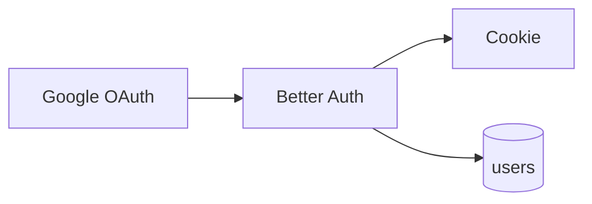
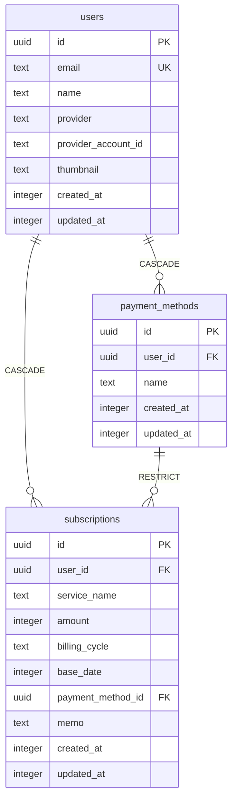
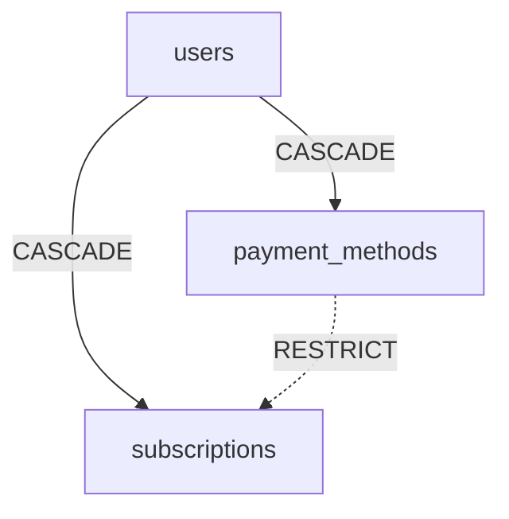

# SubsQ データベース設計書

## 概要

| 項目 | 内容 |
|------|------|
| データベース | PostgreSQL（Neon） |
| ORM | Drizzle ORM |
| 認証 | Better Auth（Stateless mode） |
| ID形式 | UUID |
| 日時形式 | INTEGER（Unix timestamp） |

## 認証アーキテクチャ


| 特徴 | 説明 |
|------|------|
| Stateless Mode | sessionテーブル不要（Cookieベース） |
| 独自usersテーブル | accountテーブル不要（usersに統合） |
| cookieCache | 5分間キャッシュでDB負荷軽減 |
| customSession | ユーザー情報をセッションに追加 |

## テーブル構成

| テーブル名 | 説明 | 管理 |
|-----------|------|------|
| users | ユーザー情報 | 独自定義 |
| subscriptions | サブスクリプション | 独自定義 |
| payment_methods | 支払い方法 | 独自定義 |

※ Better Auth の session / account テーブルは使用しない（Stateless mode）

---

## 📦 テーブル定義

### 1) users（ユーザー）

| **カラム** | **型** | **説明** |
|-----------|--------|----------|
| id (PK) | UUID | ユーザーID |
| email | TEXT | メールアドレス（ユニーク） |
| name | TEXT | 表示名 |
| provider | TEXT | 認証プロバイダー（例: google） |
| provider_account_id | TEXT | プロバイダー側のアカウントID |
| thumbnail | TEXT | プロフィール画像URL（nullable） |
| created_at | INTEGER | 作成日時（Unix timestamp） |
| updated_at | INTEGER | 更新日時（Unix timestamp） |

**制約**:
- email: NOT NULL, UNIQUE
- name: NOT NULL
- provider: NOT NULL
- provider_account_id: NOT NULL
- UNIQUE(provider, provider_account_id)

**インデックス**:
- UNIQUE INDEX(email)
- UNIQUE INDEX(provider, provider_account_id)

### 2) subscriptions（サブスクリプション）

| **カラム** | **型** | **説明** |
|-----------|--------|----------|
| id (PK) | UUID | サブスクリプションID |
| user_id (FK→users.id) | UUID | ユーザーID |
| service_name | TEXT | サービス名（空NG） |
| amount | INTEGER | 金額（0〜1,000,000） |
| billing_cycle | TEXT | 請求サイクル（'monthly' / 'yearly'） |
| base_date | INTEGER | 基準日（Unix timestamp） |
| payment_method_id (FK→payment_methods.id) | UUID | 支払い方法ID（nullable） |
| memo | TEXT | メモ（nullable） |
| created_at | INTEGER | 作成日時（Unix timestamp） |
| updated_at | INTEGER | 更新日時（Unix timestamp） |

**制約**:
- user_id: NOT NULL, ON DELETE CASCADE
- service_name: NOT NULL
- payment_method_id: ON DELETE RESTRICT
- amount: CHECK(amount >= 0 AND amount <= 1000000)
- billing_cycle: CHECK(billing_cycle IN ('monthly', 'yearly'))

**インデックス**:
- INDEX(user_id)
- INDEX(payment_method_id)

### 3) payment_methods（支払い方法）

| **カラム** | **型** | **説明** |
|-----------|--------|----------|
| id (PK) | UUID | 支払い方法ID |
| user_id (FK→users.id) | UUID | ユーザーID |
| name | TEXT | 支払い方法名（空NG） |
| created_at | INTEGER | 作成日時（Unix timestamp） |
| updated_at | INTEGER | 更新日時（Unix timestamp） |

**制約**:
- user_id: NOT NULL, ON DELETE CASCADE
- name: NOT NULL

**インデックス**:
- INDEX(user_id)

---

## 🗺️ ER図


### リレーション

| 親 | 子 | 関係 | ON DELETE |
|----|---|------|-----------|
| users | subscriptions | 1:N | CASCADE |
| users | payment_methods | 1:N | CASCADE |
| payment_methods | subscriptions | 1:N | RESTRICT |

---

## 🔒 外部キー制約とON DELETE設定


| 操作 | 動作 | 理由 |
|------|------|------|
| User退会 | subscriptions, payment_methods が自動削除 | CASCADE により一括削除 |
| PaymentMethod削除（未使用） | 削除成功 | 参照するsubscriptionがない |
| PaymentMethod削除（使用中） | エラー | RESTRICT により削除不可 |

---

## 🔄 集約境界とトランザクション境界

### 集約の定義

| 集約 | 集約ルート | メンバー | 外部参照 |
|------|----------|---------|---------|
| Userチーム | users | なし | なし |
| Subscriptionチーム | subscriptions | なし | users, payment_methods |
| PaymentMethodチーム | payment_methods | なし | users |

### トランザクション境界

| 操作 | トランザクション | 理由 |
|------|----------------|------|
| User 作成/更新 | 不要 | 単一テーブル操作 |
| Subscription CRUD | 不要 | 単一テーブル操作 |
| PaymentMethod 作成/更新 | 不要 | 単一テーブル操作 |
| PaymentMethod 削除 | 不要 | RESTRICT制約がDBレベルでチェック |
| User 退会 | 不要 | CASCADE制約がDBレベルで処理 |

---

## 📝 Drizzle ORM スキーマ

### schema.ts
```typescript
import { pgTable, uuid, text, integer, check, uniqueIndex, index } from 'drizzle-orm/pg-core';
import { sql } from 'drizzle-orm';

// ===========================================
// Users テーブル（独自定義）
// ===========================================

export const users = pgTable(
  'users',
  {
    id: uuid('id').primaryKey().defaultRandom(),
    email: text('email').notNull().unique(),
    name: text('name').notNull(),
    provider: text('provider').notNull(),
    providerAccountId: text('provider_account_id').notNull(),
    thumbnail: text('thumbnail'),
    createdAt: integer('created_at', { mode: 'timestamp' }).notNull(),
    updatedAt: integer('updated_at', { mode: 'timestamp' }).notNull(),
  },
  (table) => ({
    emailIdx: uniqueIndex('users_email_idx').on(table.email),
    providerAccountIdx: uniqueIndex('users_provider_account_idx').on(
      table.provider,
      table.providerAccountId
    ),
  })
);

// ===========================================
// Payment Methods テーブル
// ===========================================

export const paymentMethods = pgTable(
  'payment_methods',
  {
    id: uuid('id').primaryKey().defaultRandom(),
    userId: uuid('user_id')
      .notNull()
      .references(() => users.id, { onDelete: 'cascade' }),
    name: text('name').notNull(),
    createdAt: integer('created_at', { mode: 'timestamp' }).notNull(),
    updatedAt: integer('updated_at', { mode: 'timestamp' }).notNull(),
  },
  (table) => ({
    userIdIdx: index('payment_methods_user_id_idx').on(table.userId),
  })
);

// ===========================================
// Subscriptions テーブル
// ===========================================

export const subscriptions = pgTable(
  'subscriptions',
  {
    id: uuid('id').primaryKey().defaultRandom(),
    userId: uuid('user_id')
      .notNull()
      .references(() => users.id, { onDelete: 'cascade' }),
    serviceName: text('service_name').notNull(),
    amount: integer('amount').notNull(),
    billingCycle: text('billing_cycle').notNull(),
    baseDate: integer('base_date').notNull(),
    paymentMethodId: uuid('payment_method_id').references(
      () => paymentMethods.id,
      { onDelete: 'restrict' }
    ),
    memo: text('memo'),
    createdAt: integer('created_at', { mode: 'timestamp' }).notNull(),
    updatedAt: integer('updated_at', { mode: 'timestamp' }).notNull(),
  },
  (table) => ({
    userIdIdx: index('subscriptions_user_id_idx').on(table.userId),
    paymentMethodIdIdx: index('subscriptions_payment_method_id_idx').on(
      table.paymentMethodId
    ),
    amountCheck: check(
      'amount_check',
      sql`${table.amount} >= 0 AND ${table.amount} <= 1000000`
    ),
    billingCycleCheck: check(
      'billing_cycle_check',
      sql`${table.billingCycle} IN ('monthly', 'yearly')`
    ),
  })
);

// ===========================================
// 型定義
// ===========================================

export type User = typeof users.$inferSelect;
export type NewUser = typeof users.$inferInsert;

export type PaymentMethod = typeof paymentMethods.$inferSelect;
export type NewPaymentMethod = typeof paymentMethods.$inferInsert;

export type Subscription = typeof subscriptions.$inferSelect;
export type NewSubscription = typeof subscriptions.$inferInsert;

// ===========================================
// BillingCycle 型
// ===========================================

export const BillingCycle = {
  MONTHLY: 'monthly',
  YEARLY: 'yearly',
} as const;

export type BillingCycleType = (typeof BillingCycle)[keyof typeof BillingCycle];
```

---

## 🔐 Better Auth 設定例

### auth.ts
```typescript
import { betterAuth } from 'better-auth';
import { customSession } from 'better-auth/plugins';
import { db } from './db';
import { users } from './schema';
import { eq } from 'drizzle-orm';

export const auth = betterAuth({
  // データベース設定なし（Stateless mode）
  
  // Google OAuth 設定
  socialProviders: {
    google: {
      clientId: process.env.GOOGLE_CLIENT_ID!,
      clientSecret: process.env.GOOGLE_CLIENT_SECRET!,
    },
  },

  // セッション設定
  session: {
    cookieCache: {
      enabled: true,
      maxAge: 300, // 5分間キャッシュ
    },
  },

  // カスタムセッションプラグイン
  plugins: [
    customSession(async ({ user, session }) => {
      // DBからユーザー情報を取得してセッションに追加
      const dbUser = await db
        .select()
        .from(users)
        .where(eq(users.providerAccountId, user.id))
        .limit(1);

      if (dbUser.length === 0) {
        return session;
      }

      return {
        ...session,
        user: {
          ...session.user,
          id: dbUser[0].id,
          thumbnail: dbUser[0].thumbnail,
        },
      };
    }),
  ],

  // コールバック
  callbacks: {
    // 初回ログイン時にユーザーを作成
    async onUserCreated({ user }) {
      await db.insert(users).values({
        email: user.email,
        name: user.name || '',
        provider: 'google',
        providerAccountId: user.id,
        thumbnail: user.image,
        createdAt: Math.floor(Date.now() / 1000),
        updatedAt: Math.floor(Date.now() / 1000),
      });
    },
  },
});
```

---

## 📊 データ例

### users

| id | email | name | provider | provider_account_id | thumbnail | created_at | updated_at |
|----|-------|------|----------|---------------------|-----------|------------|------------|
| uuid-user-1 | user@example.com | 山田太郎 | google | 1234567890 | https://... | 1710000000 | 1710000000 |

### payment_methods

| id | user_id | name | created_at | updated_at |
|----|---------|------|------------|------------|
| uuid-pay-1 | uuid-user-1 | 楽天カード | 1710000000 | 1710000000 |
| uuid-pay-2 | uuid-user-1 | PayPal | 1710000000 | 1710000000 |

### subscriptions

| id | user_id | service_name | amount | billing_cycle | base_date | payment_method_id | memo | created_at | updated_at |
|----|---------|--------------|--------|---------------|-----------|-------------------|------|------------|------------|
| uuid-sub-1 | uuid-user-1 | Netflix | 1490 | monthly | 1710460800 | uuid-pay-1 | スタンダード | 1710000000 | 1710000000 |
| uuid-sub-2 | uuid-user-1 | Spotify | 980 | monthly | 1709251200 | uuid-pay-2 | NULL | 1710000000 | 1710000000 |
| uuid-sub-3 | uuid-user-1 | iCloud+ | 3900 | yearly | 1695168000 | uuid-pay-1 | 50GB | 1710000000 | 1710000000 |