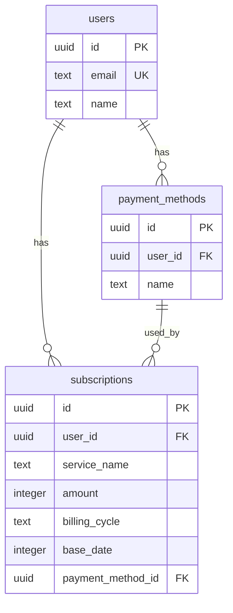

# API設計書（MVP）

## 概要

このドキュメントは、システムが提供するAPIの仕様を定義します。

### MVP段階とAPI設計の関係

| フェーズ | データアクセス方式 | 本ドキュメントの役割 |
|---------|------------------|-------------------|
| **MVP（現在）** | Server Functions / Server Actions → Service → DB直接 | DTOスキーマの定義として使用 |
| **将来** | Server Functions / Server Actions → 外部API | REST APIエンドポイント仕様として使用 |

MVP段階では、以下の方式でデータアクセスを行います：

| 呼び出し元 | 使用する関数 | ファイル |
|-----------|------------|---------|
| Server Component (RSC) | Server Functions | `external/handler/*.server.ts` |
| Client Component | Server Actions | `external/handler/*.action.ts` |

リクエスト/レスポンスの型定義（DTO）は本ドキュメントと同一のスキーマを使用します。

詳細は [External Layer設計](../frontend/docs/05_external_layer.md) を参照してください。

## API構成

### ベースURL
```
/api/v1
```

### エンドポイント分類

| 分類 | 説明 | HTTPメソッド |
|------|------|-------------|
| **Query（読み取り）** | データ取得のみ。副作用なし | GET |
| **Command（書き込み）** | データの作成・更新・削除。副作用あり | POST, PUT, DELETE |

### URL設計とHTTPメソッド

| 操作 | HTTPメソッド | URLパターン | 用途 |
|------|-------------|------------|------|
| 一覧取得 | GET | `/api/v1/xxx` | 全件または条件付き取得 |
| 単体取得 | GET | `/api/v1/xxx/:id` | IDで1件取得 |
| 作成 | POST | `/api/v1/xxx` | 新規作成 |
| 更新 | PUT | `/api/v1/xxx/:id` | 既存更新 |
| 削除 | DELETE | `/api/v1/xxx/:id` | 削除 |

---

## 認証アーキテクチャ

Better Auth を使用した認証システム。Google OAuth 2.0 による認証と、stateless セッション管理を採用しています。

| 特徴 | 説明 |
|------|------|
| Stateless Mode | sessionテーブル不要（Cookieベース） |
| 独自usersテーブル | accountテーブル不要（usersに統合） |
| cookieCache | 5分間キャッシュでDB負荷軽減 |
| customSession | ユーザー情報をセッションに追加 |

詳細は [認証システム実装ガイド](../frontend/docs/08_authentication.md) を参照してください。

---

## エラーレスポンス

RFC 7807準拠の形式を使用します。
```typescript
ErrorResponse {
  type: string      // エラータイプのURI
  title: string     // エラーの概要
  status: number    // HTTPステータスコード
  detail: string    // エラーの詳細説明
  instance?: string // エラーが発生したリソースのパス
}
```

### エラー例
```json
{
  "type": "https://subsq.example.com/errors/not-found",
  "title": "Resource Not Found",
  "status": 404,
  "detail": "指定されたサブスクリプションが見つかりません",
  "instance": "/api/v1/subscriptions/uuid-xxx"
}
```

### エラーコード一覧

| status | type | title | 説明 |
|--------|------|-------|------|
| 400 | `/errors/bad-request` | Bad Request | リクエストが不正 |
| 401 | `/errors/unauthorized` | Unauthorized | 認証が必要 |
| 403 | `/errors/forbidden` | Forbidden | 権限がない |
| 404 | `/errors/not-found` | Not Found | リソースが見つからない |
| 409 | `/errors/conflict` | Conflict | 競合（使用中の支払い方法削除など） |
| 422 | `/errors/validation-error` | Validation Error | バリデーションエラー |
| 500 | `/errors/internal-error` | Internal Server Error | サーバー内部エラー |

---

## Users（ユーザー）API

### 現在のユーザー取得

**URL**: `GET /api/v1/users/me`

**説明**: ログイン中のユーザー情報を取得

**Request**: なし

**Response**:
```typescript
UserResponse {
  id: string
  email: string
  name: string
  provider: string
  providerAccountId: string
  thumbnail: string | null
  createdAt: string    // ISO 8601形式
  updatedAt: string    // ISO 8601形式
}
```

**ビジネスルール**:
- 認証必須

---

### ユーザー退会

**URL**: `DELETE /api/v1/users/me`

**説明**: アカウントと関連データをすべて削除

**Request**: なし

**Response**:
```typescript
DeleteUserResponse {
  success: boolean
}
```

**ビジネスルール**:
- 認証必須
- 関連データ（subscriptions, payment_methods）はCASCADEで自動削除

---

## Subscriptions（サブスクリプション）API

### Query Operations

#### サブスクリプション一覧取得

**URL**: `GET /api/v1/subscriptions`

**説明**: ログインユーザーのサブスクリプション一覧と合計金額を取得

**Request**: なし（認証情報からユーザーを特定）

**Response**:
```typescript
SubscriptionResponse {
  id: string
  userId: string
  serviceName: string
  amount: number
  billingCycle: "monthly" | "yearly"
  baseDate: number              // Unix timestamp
  nextBillingDate: string       // ISO 8601形式（計算値）
  paymentMethodId: string | null
  paymentMethod: {
    id: string
    name: string
  } | null
  memo: string | null
  monthlyAmount: number         // 月額換算（計算値）
  yearlyAmount: number          // 年額換算（計算値）
  createdAt: string             // ISO 8601形式
  updatedAt: string             // ISO 8601形式
}

ListSubscriptionsResponse {
  subscriptions: SubscriptionResponse[]
  summary: {
    monthlyTotal: number        // 月額換算合計
    yearlyTotal: number         // 年額換算合計
    count: number               // サブスク件数
  }
}
```

**ビジネスルール**:
- 認証必須
- 自分のサブスクリプションのみ取得可能
- 作成日時の降順でソート（新しいものが上）
- `nextBillingDate`, `monthlyAmount`, `yearlyAmount` はサーバー側で計算

---

#### サブスクリプション詳細取得

**URL**: `GET /api/v1/subscriptions/:id`

**Request (URL Parameters)**:
```typescript
id: string  // サブスクリプションID
```

**Response**:
```typescript
GetSubscriptionByIdResponse = SubscriptionResponse | null
```

**ビジネスルール**:
- 認証必須
- 自分のサブスクリプションのみ取得可能
- 存在しないIDまたは他ユーザーのリソースの場合は404

---

### Command Operations

#### サブスクリプション作成

**URL**: `POST /api/v1/subscriptions`

**Request**:
```typescript
CreateSubscriptionRequest {
  serviceName: string                    // 必須: 1文字以上
  amount: number                         // 必須: 0〜1,000,000
  billingCycle: "monthly" | "yearly"     // 必須
  baseDate: number                       // 必須: Unix timestamp
  paymentMethodId?: string               // 任意
  memo?: string                          // 任意
}
```

**Response**:
```typescript
CreateSubscriptionResponse = SubscriptionResponse
```

**ビジネスルール**:
- 認証必須
- `paymentMethodId` を指定する場合、自分の支払い方法である必要がある
- 同名のサービス名は許可（重複登録可能）

---

#### サブスクリプション更新

**URL**: `PUT /api/v1/subscriptions/:id`

**Request**:
```typescript
UpdateSubscriptionRequest {
  serviceName: string
  amount: number
  billingCycle: "monthly" | "yearly"
  baseDate: number
  paymentMethodId?: string | null        // nullで支払い方法を解除
  memo?: string | null
}
```

**Response**:
```typescript
UpdateSubscriptionResponse = SubscriptionResponse
```

**ビジネスルール**:
- 認証必須
- 自分のサブスクリプションのみ更新可能

---

#### サブスクリプション削除

**URL**: `DELETE /api/v1/subscriptions/:id`

**Request (URL Parameters)**:
```typescript
id: string  // サブスクリプションID
```

**Response**:
```typescript
DeleteSubscriptionResponse {
  success: boolean
}
```

**ビジネスルール**:
- 認証必須
- 自分のサブスクリプションのみ削除可能
- 物理削除

---

## PaymentMethods（支払い方法）API

### Query Operations

#### 支払い方法一覧取得

**URL**: `GET /api/v1/payment-methods`

**説明**: ログインユーザーの支払い方法一覧を取得

**Request**: なし

**Response**:
```typescript
PaymentMethodResponse {
  id: string
  userId: string
  name: string
  usageCount: number            // この支払い方法を使用しているサブスク数
  createdAt: string             // ISO 8601形式
  updatedAt: string             // ISO 8601形式
}

ListPaymentMethodsResponse = PaymentMethodResponse[]
```

**ビジネスルール**:
- 認証必須
- 自分の支払い方法のみ取得可能

---

#### 支払い方法詳細取得

**URL**: `GET /api/v1/payment-methods/:id`

**Request (URL Parameters)**:
```typescript
id: string  // 支払い方法ID
```

**Response**:
```typescript
GetPaymentMethodByIdResponse = PaymentMethodResponse | null
```

**ビジネスルール**:
- 認証必須
- 自分の支払い方法のみ取得可能

---

### Command Operations

#### 支払い方法作成

**URL**: `POST /api/v1/payment-methods`

**Request**:
```typescript
CreatePaymentMethodRequest {
  name: string    // 必須: 1文字以上
}
```

**Response**:
```typescript
CreatePaymentMethodResponse = PaymentMethodResponse
```

**ビジネスルール**:
- 認証必須
- 同名の支払い方法は許可（重複登録可能）

---

#### 支払い方法更新

**URL**: `PUT /api/v1/payment-methods/:id`

**Request**:
```typescript
UpdatePaymentMethodRequest {
  name: string
}
```

**Response**:
```typescript
UpdatePaymentMethodResponse = PaymentMethodResponse
```

**ビジネスルール**:
- 認証必須
- 自分の支払い方法のみ更新可能

---

#### 支払い方法削除

**URL**: `DELETE /api/v1/payment-methods/:id`

**Request (URL Parameters)**:
```typescript
id: string  // 支払い方法ID
```

**Response**:
```typescript
DeletePaymentMethodResponse {
  success: boolean
}
```

**ビジネスルール**:
- 認証必須
- 自分の支払い方法のみ削除可能
- **使用中（usageCount > 0）の支払い方法は削除不可** → 409 Conflict

---

## ドメインモデルの関係


---

## 認証・認可の方針

### 認証方式

- **Google OAuth 2.0** による認証（Better Auth）
- **Stateless Mode**: セッション情報はCookieに保存
- すべてのAPIは認証必須

### 認可（権限チェック）

SubsQはプライベートなデータ管理アプリのため、**自分のデータのみ操作可能**というシンプルなルールです。

| リソース | 閲覧 | 作成 | 更新 | 削除 |
|---------|------|------|------|------|
| Subscription | 自分のみ | ○ | 自分のみ | 自分のみ |
| PaymentMethod | 自分のみ | ○ | 自分のみ | 自分のみ（未使用時） |
| User | 自分のみ | 自動 | - | 自分のみ |

### 権限チェック一覧

| 操作 | 認証 | 所有者確認 | その他の条件 |
|-----|------|----------|------------|
| サブスク一覧取得 | 必須 | 自動（自分のみ） | - |
| サブスク詳細取得 | 必須 | 必須 | - |
| サブスク作成 | 必須 | 自動設定 | paymentMethodIdは自分のもの |
| サブスク更新 | 必須 | 必須 | - |
| サブスク削除 | 必須 | 必須 | - |
| 支払い方法一覧取得 | 必須 | 自動（自分のみ） | - |
| 支払い方法詳細取得 | 必須 | 必須 | - |
| 支払い方法作成 | 必須 | 自動設定 | - |
| 支払い方法更新 | 必須 | 必須 | - |
| 支払い方法削除 | 必須 | 必須 | 未使用のみ |
| ユーザー情報取得 | 必須 | 自動（自分のみ） | - |
| ユーザー退会 | 必須 | 自動（自分のみ） | - |

---

## 計算ロジック

### 次回請求日の計算
```typescript
function calculateNextBillingDate(baseDate: number, billingCycle: "monthly" | "yearly"): Date {
  const today = new Date();
  today.setHours(0, 0, 0, 0);
  
  let nextDate = new Date(baseDate * 1000);
  
  while (nextDate < today) {
    if (billingCycle === "monthly") {
      nextDate.setMonth(nextDate.getMonth() + 1);
    } else {
      nextDate.setFullYear(nextDate.getFullYear() + 1);
    }
  }
  
  return nextDate;
}
```

### 月額換算・年額換算
```typescript
function toMonthlyAmount(amount: number, billingCycle: "monthly" | "yearly"): number {
  return billingCycle === "monthly" ? amount : Math.floor(amount / 12);
}

function toYearlyAmount(amount: number, billingCycle: "monthly" | "yearly"): number {
  return billingCycle === "yearly" ? amount : amount * 12;
}
```

---

## バリデーションルール

| フィールド | ルール |
|-----------|-------|
| `serviceName` | 1文字以上、空文字不可 |
| `amount` | 0以上1,000,000以下の整数 |
| `billingCycle` | "monthly" または "yearly" |
| `baseDate` | 有効なUnix timestamp |
| `name`（支払い方法） | 1文字以上、空文字不可 |
| `id` | UUID v4形式 |

---

## APIエンドポイント一覧

| メソッド | エンドポイント | 説明 |
|---------|--------------|------|
| GET | `/api/v1/users/me` | 現在のユーザー取得 |
| DELETE | `/api/v1/users/me` | ユーザー退会 |
| GET | `/api/v1/subscriptions` | サブスク一覧取得 |
| GET | `/api/v1/subscriptions/:id` | サブスク詳細取得 |
| POST | `/api/v1/subscriptions` | サブスク作成 |
| PUT | `/api/v1/subscriptions/:id` | サブスク更新 |
| DELETE | `/api/v1/subscriptions/:id` | サブスク削除 |
| GET | `/api/v1/payment-methods` | 支払い方法一覧取得 |
| GET | `/api/v1/payment-methods/:id` | 支払い方法詳細取得 |
| POST | `/api/v1/payment-methods` | 支払い方法作成 |
| PUT | `/api/v1/payment-methods/:id` | 支払い方法更新 |
| DELETE | `/api/v1/payment-methods/:id` | 支払い方法削除 |