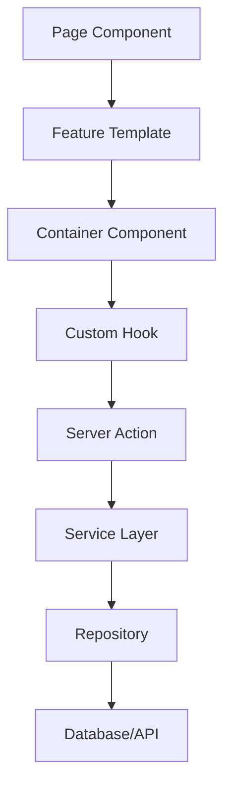
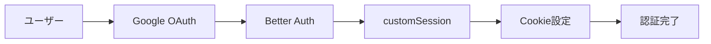

# アーキテクチャ設計

## 全体構成

```
frontend/src/
├─ app/          # App Router (薄く保つ)
├─ features/     # 機能別モジュール
├─ shared/       # 共通コンポーネント・ユーティリティ
└─ external/     # 外部連携層 (API・DB)
```

## 設計原則

1. **関心の分離**: 各層の責任を明確に定義
2. **Server Components優先**: クライアントサイドのJSを最小化
3. **型安全性**: TypeScriptとZodによる完全な型保証
4. **テスタビリティ**: 各層を独立してテスト可能に
5. **変更可用性**: バックエンド技術の変更に対する柔軟性を確保

## レイヤーの責務

### App Router (`/app`)
- ルーティング定義
- メタデータ設定
- 認証チェック
- エラーハンドリング

### Features (`/features`)
- ビジネスロジック
- UI実装
- 状態管理
- カスタムフック

### Shared (`/shared`)
- 共通コンポーネント
- ユーティリティ関数
- 型定義
- プロバイダー

### External (`/external`)
- データアクセス（現在）/ API連携（将来）
- ビジネスロジック実装
- データ変換（DTO）
- 変更可用性の確保

## データフロー



## 認証アーキテクチャ

### 技術スタック
- **Better Auth**: Google OAuth 2.0認証
- **Statelessセッション**: Cookie-basedセッション管理（sessionsテーブル不要）
- **二段階キャッシュ**: Cookie Cache (5分) + unstable_cache (5分)

### 認証フロー


### アーキテクチャの特徴

#### Statelessセッション
- セッション情報をDBではなく署名付きCookieで管理
- 水平スケーリングが容易
- セッションテーブル不要

#### customSessionプラグイン
- Google ID → アプリ内UUIDの変換
- usersテーブルからユーザー情報を取得
- セッションに追加データを注入

#### 二段階キャッシュ戦略
1. **Cookie Cache（第1層）**: ブラウザ側で5分間キャッシュ
2. **unstable_cache（第2層）**: サーバー側で5分間キャッシュ
3. **DB問い合わせ**: 両方のキャッシュミス時のみ実行

### 詳細設計

認証システムの詳細は [認証システム実装ガイド](./08_authentication.md) を参照。